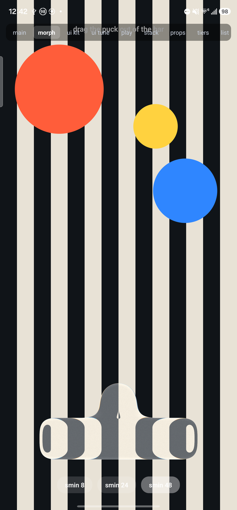
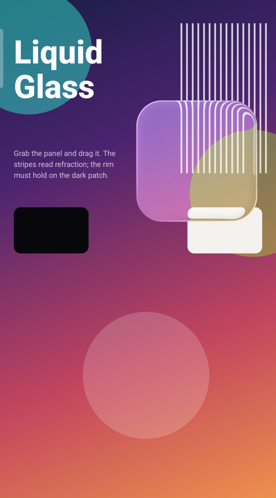
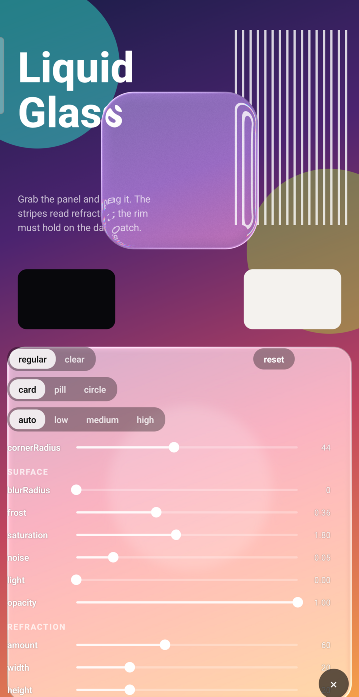

# expo-liquid-glass-ui

Liquid Glass for React Native, in one package: the **glass view** — Apple's `UIGlassEffect` on
iOS 26+, a custom Metal renderer below it, and an AGSL port on Android 13+ with graceful tiers
down to API 29 — and the **controls** built on it: a tab bar, buttons that merge into their neighbours when
pressed, icon buttons, chips, a switch, slider, stepper, text input, segmented control, card,
toolbar, toast, bottom sheet, a stretch-merge morph group and a scroll-edge scrim — all in the
iOS 26 style, running on Android and on iOS versions that never got them.

The view began as a fork of [rit3zh/expo-liquid-glass-view](https://github.com/rit3zh/expo-liquid-glass-view)
(see `NOTICE`); it no longer tracks upstream. Everything native — Swift, Metal, Kotlin, AGSL — ships
here, and there is no config plugin: autolinking is the whole install.

The designs are ported from the
[AndroidLiquidGlass](https://github.com/Kyant0/AndroidLiquidGlass) catalog — `LiquidButton`,
`LiquidToggle`, `LiquidSlider` and `LiquidBottomTabs` — with the text field styled to match. Not
just the look: the catalog's `DampedDragAnimation` physics rig is ported whole, so the controls
share its springs, its velocity-driven jelly and its convergence-gated release. The two shader
renderers — Android's and the Metal one for iOS below 26 — run **the same algorithm**: everything
measured against real iOS 26 glass lands on both, and on top of it the goodies the catalog
demonstrates: adaptive glass that reads the backdrop and dresses for it, a whole-surface
magnification, an inner shadow, and a highlight that can follow gravity.

## Install

Not on npm yet — install from git, with the two peers the controls animate through:

```bash
npm install github:capthndsme/expo-liquid-glass-ui react-native-reanimated react-native-gesture-handler
```

If a project still has `expo-liquid-glass-view` installed, remove it: this package registers the
same native view names, and two copies fail at startup with "Tried to register two views with the
same name".

Gestures and springs are Reanimated worklets driven by `react-native-gesture-handler` — drag
tracking, the springs, and even the switch's track-color interpolation run on the UI thread with
**no JS work per frame**, which is what keeps the controls smooth on 120 Hz displays and under a
busy JS thread. Both peers are the Expo defaults; wrap the app in `GestureHandlerRootView` as
usual.

## Usage

```tsx
import { LiquidGlassView } from "expo-liquid-glass-ui";

<LiquidGlassView
  variant="regular"
  cornerRadius={32}
  tint="#4da3ff33"
  interactive
  style={{ width: 260, height: 120 }}
  containerStyle={{ alignItems: "center", justifyContent: "center" }}
>
  <Text style={{ color: "#fff" }}>Liquid Glass</Text>
</LiquidGlassView>;
```

Corners take one number for all four, or an object for per-corner control.

```tsx
<LiquidGlassView cornerRadius={32} />
<LiquidGlassView cornerRadius={{ topLeft: 32, topRight: 32 }} />
```

### Backends

`renderer` defaults to `"auto"` — `UIGlassEffect` on iOS 26+, the Metal renderer below it. Force one with `renderer="native"` or `renderer="metal"`, and read back what a device actually chose:

```tsx
import { supportsGlass, supportsNativeGlass } from "expo-liquid-glass-ui";

<LiquidGlassView onRendererChange={(renderer) => console.log(renderer)} />;
```

Two booleans, both resolved once at import, answering different questions:

- `supportsGlass` — will `LiquidGlassView` render glass at all? iOS: always. Android: API 29+.
  This is the flag the component itself mounts on.
- `supportsNativeGlass` — is Apple's `UIGlassEffect` here (iOS 26+)? Switch *layout* strategies
  on this one (system tabs vs a floating pill), never visibility — below 26 glass still renders,
  via Metal.

On Android `renderer` has no effect — there is no Apple material to ask for, so both `"native"` and
`"metal"` resolve to the shader path exactly as `"native"` does on iOS below 26. An existing iOS
screen needs no branching on it.

### Liquid morphing

<p align="center">
  
</p>

On the shader renderers (`agsl` on Android, Metal on iOS), `metal.morph` folds a second rounded
rect into the view's shape with a smooth-min — refraction, dispersion and the border light all
follow the merged silhouette, so the two shapes neck together and separate like iOS 26's
`UIGlassContainerEffect` merge. Pair it with `metal.shape`, which insets the primary shape and
turns the view into a canvas the partner can move inside; both are `dp`, layout-style, and
animatable per-frame via Reanimated `useAnimatedProps`. The example's **morph** tab is the
playground (shot above: Galaxy S23, `agsl`, `smoothing: 48`).

### Adaptive glass

iOS 26's material reads what is behind it and dresses for it: over dark content the glass goes
dark with light text, over light content the reverse. The shader renderers do the same with
`adaptive`: the view samples the mean luminance of the backdrop under it — Android renders the
provider content into an 8×8 probe off the RenderThread, iOS reads the capture it already holds —
at most four times a second and only when something moved, settles on a polarity with hysteresis
(0.45 / 0.55), crossfades its frost over 350 ms, and reports through `onBackdropLuminance`.
`useAdaptiveGlass` turns the report into a scheme for the content on the glass, with a UI-thread
`progress` for crossfading colours; the tab bar and button take an `adaptive` prop that wires all
of it:

```tsx
const adaptive = useAdaptiveGlass();
const { colors } = useGlassUITheme(adaptive.scheme);
const labelStyle = useAnimatedStyle(() => ({
  color: interpolateColor(adaptive.progress.value, [0, 1], ["#111", "#f4f4f4"]),
}));

<LiquidGlassView {...adaptive.glassProps} tint={colors.tabBarSurface}>
  <Animated.Text style={labelStyle}>Adaptive</Animated.Text>
</LiquidGlassView>

<LiquidGlassTabBar adaptive … />
```

The native iOS 26 glass adapts on its own and ignores the prop. The example's **goodies** tab has
a draggable adaptive card over light/dark bands, with the reading on screen.

### Inner shadow, magnification, a gravity-lit rim

Three more `metal` dials, on both shader renderers:

- `innerShadow: { radius, offsetX, offsetY, opacity }` — the soft dark band along the inside of
  the silhouette that gives a lifted control its thickness (Kyant's `InnerShadow`, iOS 26's
  grabbed pill). The kit ramps it in with press progress on the tab pill (8 dp) and the thumbs
  (4 dp).
- `magnification` — a whole-surface lens: the backdrop reads enlarged through the pane, the way
  iOS 26's slider thumb enlarges the track. `1` is off; the example's goodies tab has a draggable
  magnifier at `1.5`.
- `useGravityHighlight` — feed it accelerometer samples (`expo-sensors`, which the kit does not
  depend on) and write its `angle` into `highlight.angle` from `useAnimatedProps`; every glass
  edge then lights as if under one fixed lamp while the phone tilts. The catalog's control-centre
  demo, without the sensor dependency.

## Android needs a provider

On Android the base library captures the backdrop explicitly. Wrap the content that should show
*through* the glass in a `LiquidGlassProvider`, and put these controls **after it as siblings —
never inside it** (a nested glass view would refract its own output). The provider is a plain
`View` on iOS and web, so one tree ships everywhere:

```tsx
import { LiquidGlassProvider } from "expo-liquid-glass-ui";

<View style={{ flex: 1 }}>
  <LiquidGlassProvider style={StyleSheet.absoluteFill}>
    {/* screen content */}
  </LiquidGlassProvider>

  {/* glass controls go here, after the provider */}
</View>;
```

Give the provider exactly **one** direct child (a wrapper `View` around your background and
scroller). Measured on device: with two direct children the native provider view lays out only the
first — the second never appears.

## Components

### LiquidGlassTabBar

A capsule glass bar with a glass pill that springs between tabs — tap a tab, or grab the pill and
drag it. It balloons to `78/56` while held, **stretches like jelly** with the drag, and snaps to
the nearest tab on release.

Six things from the reference are ported in full:

- **The jelly is velocity-driven counter-scaling**, not a lag or trail term. X divides and Y
  multiplies by a clamped ±20% of the follower's velocity, so the deformation is
  volume-preserving and inverts on reverse motion. The two axes use deliberately mismatched
  springs (`ζ 0.6` on X, `0.7` on Y) — that 0.1 asymmetry *is* the wobble. The tab bar runs
  it past the reference (`jelly: { gain: 2, limit: 0.45 }`, and a follower that overshoots):
  iOS 26's pill overruns its tab and a fast flick pulls it into a hotdog. The slider and the
  switch keep the reference's numbers.
- **The grab outlives the finger.** Release is gated on convergence: the pill stays inflated and
  refractive until it is within 2.5% of its target, then deflates. Deflating on finger-up instead
  is the usual way this gets lost.
- **The pill shows the bar, not the screen.** The bar runs `vibrancy → blur(8dp) → lens(24,24)`
  permanently, and the accent copy the pill reads through wears that same recipe at the bar's
  size — so the bar's lens runs on under the resting pill instead of stopping at its edge, and a
  strong `barMetal` refracts just as strongly through the pill. The pill's own recipe adds
  nothing at rest; the grab lays its lens and colour split on top.
- **The accent row lives under the glass.** A screen-invisible copy of the row, tinted to the
  accent, is composited into the pill's backdrop — so it reaches the eye only through the pill's
  lens and dispersion, cut exactly at the capsule edge. The copy is the row's size, always: the
  grab scales the whole bar, icons included, and shrinks nothing — iOS 26's motion, checked
  against an iPhone 14 Pro Max.
- **One departure from the reference.** Kyant's `tabsBackdrop` is a 56dp capsule inside the
  64dp bar with `lens(24dp × progress)` — nothing at rest — so its resting pill is a flat, unbent
  window in a bent bar. This kit's copy is the bar's size with the bar's lens always on, and the
  refraction is continuous across the pill. It costs nothing extra: the copy already blurred the
  same pixels, and the lens is uniforms on a shader that ran anyway.
- **The bar barely lights up under the grabbed pill.** The reference's `InteractiveHighlight` (a
  flat additive wash plus a soft lobe centred on the pill, on its own bouncier spring,
  `ζ 0.5 / k 300`, released the instant the finger lifts) is scaled by `pressLight`, default 0.1:
  iOS 26 lightens the bar only faintly, and the full wash pushed a light bar toward white, leaving
  the chip and the lifted pill nowhere lighter to go. `pressLight={1}` is the reference, `0` none.

```tsx
import { LiquidGlassTabBar } from "expo-liquid-glass-ui";
import { Ionicons } from "@expo/vector-icons";

const [index, setIndex] = useState(0);

<LiquidGlassTabBar
  selectedIndex={index}
  onTabSelected={setIndex}
  tabs={[
    { key: "home", title: "Home", icon: ({ color, size }) => <Ionicons name="home" color={color} size={size} /> },
    { key: "search", title: "Search", icon: ({ color, size }) => <Ionicons name="search" color={color} size={size} /> },
    { key: "profile", title: "You", icon: ({ color, size }) => <Ionicons name="person" color={color} size={size} /> },
  ]}
  style={{ position: "absolute", left: 16, right: 16, bottom: 32 }}
/>;
```

`variant` (`"regular"` | `"clear"`), `accentColor`, `inactiveColor`, `tint`,
`blurRadius` (the bar's blur, default 8 — the accent copy the pill reads through wears the bar's
whole recipe, so the resting pill stays the bar's frost), `height` (default 64), `pillHeight` (56),
`pillPressedScale`, `pressLight` (0.1), `barMetal`, `pillMetal`, `pillDraggedMetal`, `pillTint`, `labelStyle` and
`providerId` are all overridable; the defaults follow the scheme (light/dark) with the iOS system
palette. `adaptive` hands that choice to the backdrop instead: the bar reads the content under it
and switches its whole dress — wash, accent, inactive colour, the pill's lift — with the frost
crossfading natively and the labels with it (see [Adaptive glass](#adaptive-glass)). The grabbed
pill also carries the reference's inner shadow (8 dp × progress) and drop shadow.

`variant="clear"` swaps the whole dress at once — the bar's material, its surface wash, and the
accent strip behind the pill — pulling the 42% container fill back to a hint and letting the glass
carry the look. The lens is unchanged; clear means less scrim, not a different lens. (Borrowing the
base library's `CLEAR_DEFAULTS` lens verbatim was a mistake worth recording: its 30dp pull over a
10dp band is tuned for a small control, and on a 64dp bar it drags the gap above the bar into a
hard stripe across the top edge.)

Measured over a mid-tone card it costs nothing: label contrast 1.28:1 against `regular`'s 1.31:1,
and the pill actually reads *better* (+9.0 against +5.8). But that fill is what bounds the worst
case over arbitrary content, which is why `regular` stays the default — reach for `clear` over
photos and video, where a scrim reads as a grey slab.

### LiquidGlassButton

A 48pt glass capsule with the reference's full jelly: a grow-on-press spring on every renderer,
plus rubber-band follow toward the finger and stretch along the drag axis — all Reanimated
worklets observing the touch without ever stealing a scroll.

```tsx
import { LiquidGlassButton } from "expo-liquid-glass-ui";

<LiquidGlassButton onPress={submit}>Continue</LiquidGlassButton>
<LiquidGlassButton onPress={buy} tint="#0088FFCC" icon={({ color, size }) => <Ionicons name="cart" color={color} size={size} />}>
  Buy now
</LiquidGlassButton>
<LiquidGlassButton size="small">Small</LiquidGlassButton>
<LiquidGlassButton size="large" loading={saving}>Save</LiquidGlassButton>
```

String children are wrapped in a styled `Text` (white when tinted, label color otherwise);
anything else renders as-is in a centered row. `icon` goes before the label and, as a function,
receives the resolved label colour and the glyph size for the button's `size` — `small` (36),
`regular` (48, the reference's) or `large` (56); `height` still overrides. `shape="circle"`
makes it exactly as wide as it is tall (see `LiquidGlassIconButton`). `loading` swaps the content
for a spinner without changing the width and ignores presses. `adaptive` makes the button read
the backdrop and dress for it — dark frost with a light label over dark content, the reverse over
light — with the label crossfading in step with the native frost.

**The press** is the shader's own: the finger dents the glass and boosts the lens under it
(`glow` with `lens`), and a light — the reference's `InteractiveHighlight`, a flat additive
`0.08` wash plus a `0.15` lobe under the finger — comes up with it, scaled by `pressLight`
(default 0.35). That lobe is sized for a bar; at full strength on a 48pt capsule it covers the
whole pane and reads as a Material pressed-state wash, which is what it used to look like — first
as a flat white view over the capsule, then at the shader's full strength. `pressLight={0}`
leaves only the inflation, the rubber band and the dent; `1` is Kyant's bar highlight. Only iOS
26's native glass and the no-glass degrade still use a flat wash, the reference's own declared
fallback, scaled the same way.

Put buttons in a `LiquidGlassGroup` and a press merges into the neighbour — see below.

### LiquidGlassGroup

iOS 26's `GlassEffectContainer` for the kit's controls: lay buttons, icon buttons or chips out
together, and pressing one **fuses it into its nearest neighbour like liquid** — the pressed
capsule inflates and rubber-bands exactly as it always did, and wherever it comes within
`spacing` of the next one the two silhouettes neck together into one pane, separating again as
the press lets go.

```tsx
import { LiquidGlassGroup, LiquidGlassButton, LiquidGlassIconButton } from "expo-liquid-glass-ui";

<LiquidGlassGroup>
  <LiquidGlassButton onPress={cancel}>Cancel</LiquidGlassButton>
  <LiquidGlassButton onPress={save} tint="#0088FFCC">Save</LiquidGlassButton>
</LiquidGlassGroup>

<LiquidGlassGroup gap={8}>
  <LiquidGlassIconButton icon={heart} accessibilityLabel="Like" />
  <LiquidGlassIconButton icon={share} accessibilityLabel="Share" />
  <LiquidGlassIconButton icon={bookmark} accessibilityLabel="Save" />
</LiquidGlassGroup>
```

On the shader renderers (Android, iOS below 26 or `renderer="metal"`) a canvas glass view under
the row draws the merged silhouette from the base package's `metal.shape` + `metal.morph`: while
a member is pressed, its own pane and its partner's crossfade out and the canvas takes over both
— the pressed one redrawn from the very same press channels its pane is transformed by, so the
two never part company — and the press light rides along. A tinted member keeps its colour
through the merge. On iOS 26 the row is wrapped in `LiquidGlassContainer` and the system merges;
with no glass at all it is a plain row.

`spacing` (28, the smooth-min reach — a neighbour further away is left alone), `gap` (12),
`direction` (`"row"` | `"column"`), `metal` and `tint` for the canvas, `providerId`. Members join
through context, so a control of your own can too: `useGlassGroupMember` takes the control's
press channels and hands back the opacity its pane should wear, and `buttonPressTransform` is
the button's press geometry as a worklet.

### LiquidGlassIconButton

A circle of glass around one glyph — the iOS 26 toolbar button. It is `LiquidGlassButton` with
`shape="circle"`: the same jelly, the same press light, the same merge inside a group, and an
`accessibilityLabel` that is required because a circle has no label to read out.

```tsx
<LiquidGlassIconButton
  icon={({ color, size }) => <Ionicons name="share-outline" color={color} size={size} />}
  accessibilityLabel="Share"
  onPress={share}
/>
```

### LiquidGlassChip

A small selectable capsule — a filter, a tag, a choice: the `small` button with a `selected`
state that wears the accent as its wash and a white label. Chips in a `LiquidGlassGroup` merge
into their neighbours when pressed like every other member.

```tsx
<LiquidGlassGroup gap={8} style={{ flexWrap: "wrap" }}>
  {FILTERS.map((f) => (
    <LiquidGlassChip key={f} label={f} selected={active.has(f)} onPress={() => toggle(f)} />
  ))}
</LiquidGlassGroup>
```

### LiquidGlassToolbar

iOS 26's floating navigation row: controls at either end that merge when pressed, and a title
between them in a capsule of its own. Nothing spans the width — each end is a `LiquidGlassGroup`
and the title floats, so the content behind shows between them.

```tsx
<LiquidGlassToolbar
  title="Library"
  leading={<LiquidGlassIconButton icon={back} accessibilityLabel="Back" onPress={goBack} />}
  trailing={
    <>
      <LiquidGlassIconButton icon={search} accessibilityLabel="Search" />
      <LiquidGlassIconButton icon={more} accessibilityLabel="More" />
    </>
  }
/>
```

### LiquidGlassStepper

The system stepper in glass: a capsule track with `−` and `+` ends around the value. Pressing an
end blooms a glass thumb over it — the segmented control's canvas thumb, lit by the press — and
the value pops as it changes. Hold an end and it keeps stepping (every 110 ms after 400 ms), the
way the system's does.

```tsx
<LiquidGlassStepper value={count} onValueChange={setCount} minimumValue={0} maximumValue={12} />
```

`step`, `autoRepeat`, `formatValue`, `height` (40), `tint`, `thumbTint`, `thumbMetal`.

### LiquidGlassCard

A pane of glass to put things on: the bar's material under the scheme wash, a continuous 24dp
corner, 16dp of padding. Give it an `onPress` and it becomes a control that presses to 98%;
otherwise it is a surface and touches pass to its children. `adaptive` flips the frost with the
backdrop — pair with `useAdaptiveGlass` for content that follows.

```tsx
<LiquidGlassCard onPress={open}>
  <Text style={styles.title}>Now playing</Text>
  <Text style={styles.body}>…</Text>
</LiquidGlassCard>
```

### LiquidGlassToast

A glass capsule that drops in from an edge with a message, waits, and leaves — on the button's
bouncy spring in and the critically damped one out. Controlled: the app owns `visible` and hears
`onDismiss` when the toast has waited `duration` (2.6 s) or been tapped; it stays mounted through
its exit so the spring finishes.

```tsx
<LiquidGlassToast
  visible={saved}
  message="Saved to your library"
  icon={({ color, size }) => <Ionicons name="checkmark-circle" color={color} size={size} />}
  onDismiss={() => setSaved(false)}
/>
```

`edge` (`"top"` | `"bottom"`), `offset` from it (60), `tint`, `metal`. Positioned absolutely
against its parent — render it last, above everything, as a sibling of the provider on Android.

### LiquidGlassSheet

A bottom sheet in glass: the bar's material with only its top corners rounded, a grab handle, a
dim behind it, and a drag that follows the finger — with resistance past the top — and decides on
release: dropped past 30 % of its height or flung down, the sheet asks to go; anywhere else it
springs back up. Controlled like the toast; the dim fades with the sheet's own travel.

```tsx
<LiquidGlassSheet visible={open} onDismiss={() => setOpen(false)} height={380}>
  <Text style={styles.sheetTitle}>Share to</Text>
  <LiquidGlassGroup>…</LiquidGlassGroup>
</LiquidGlassSheet>
```

`height` (420), `cornerRadius` (28), `handle`, `dim` (0.25), `dismissOnTap`, `tint`, `metal`.
Positioned absolutely at the bottom of its parent — render it last, as a sibling of the provider
on Android.

### LiquidGlassSwitch

The 64×28 toggle: a colored capsule track under a 40×24 glass thumb. At rest the thumb wears an
opaque white fill over an 8dp frost; pressing melts the fill away, drops the blur to **zero** and
balloons the bare glass to 1.5× — a full lens ball with chromatic dispersion over a combined
`[screen, track]` backdrop, so the green body and the world behind the switch both bend through
it. Drag it across or tap to toggle. Both routes play the same press → fly → release
choreography, and both carry the jelly (at the reference's gentler `÷50` setting).

```tsx
import { LiquidGlassSwitch } from "expo-liquid-glass-ui";

<LiquidGlassSwitch value={enabled} onValueChange={setEnabled} />;
```

`accentColor` (on-state, defaults to system green) and `trackColor` take parseable color strings —
they feed `Animated` color interpolation.

### LiquidGlassSlider

A 6dp track under the same 40×24 glass thumb the switch uses — but on the reference's
full-strength jelly setting (`÷10` rather than `÷50`), which is the control the effect was
originally tuned on. A tap on the track seeks without jumping: it plays the whole grab, so
seeking looks exactly like dragging.

```tsx
import { LiquidGlassSlider } from "expo-liquid-glass-ui";

const [volume, setVolume] = useState(0.5);

<LiquidGlassSlider value={volume} onValueChange={setVolume} />;
```

`minimumValue`/`maximumValue` (0–1 by default), `accentColor`, `trackColor`, `onSlidingComplete`,
`thumbMetal`, `thumbPressedMetal` and `providerId` are all overridable. Past either end the thumb
rubber-bands (10 dp through a tanh) and `onEdgeReached` fires once per arrival — the moment the
system slider clicks; wire `expo-haptics` there, the kit takes no dependency on it. Held, the thumb
wears a 4 dp inner shadow and a resting 4 dp drop shadow, both from the reference.

### LiquidGlassTextInput

A glass capsule field with `leading`/`trailing` slots and an accent focus ring that springs in.
Accepts every `TextInput` prop.

```tsx
import { LiquidGlassTextInput } from "expo-liquid-glass-ui";

<LiquidGlassTextInput
  placeholder="Search"
  value={query}
  onChangeText={setQuery}
  leading={<Ionicons name="search" size={18} color="#8E8E93" />}
/>;
```

### LiquidGlassMorphGroup

The iOS 26 stretch-merge: drag a capsule toward its neighbour and the two fuse like liquid;
release over it and `onMerge` fires — what merging *means* is yours. On the shader renderers
(Android 13+, iOS below 26 or `renderer="metal"`) a canvas glass view under the row draws the
merged silhouette via the base package's `metal.shape` + `metal.morph`; on iOS 26 the row is
wrapped in `LiquidGlassContainer` and the system's own merge takes over; with no glass at all the
capsules are plain washed views and the gesture still works.

```tsx
import { LiquidGlassMorphGroup } from "expo-liquid-glass-ui";

<LiquidGlassMorphGroup
  items={[
    { key: "copy", label: "Copy" },
    { key: "share", label: "Share" },
  ]}
  onMerge={(from, to) => combine(from, to)}
/>;
```

### LiquidGlassScrim

The scroll-edge melt: content slides under it sharp and dissolves into blur toward the screen
edge (`metal.progressiveBlur`, a true variable-radius Gaussian on Android 13+ and the iOS Metal
renderer). Hugs an edge; children — typically a tab bar or toolbar — render inside, untouched.

```tsx
import { LiquidGlassScrim } from "expo-liquid-glass-ui";

<LiquidGlassScrim edge="bottom" size={220} radius={26}>
  <MyToolbar />
</LiquidGlassScrim>;
```

### LiquidGlassSegmentedControl

A segmented control whose thumb travels like liquid: on selection it detaches, stretches along
its flight, and a shrinking droplet stays necked to it for a beat before being absorbed.

```tsx
import { LiquidGlassSegmentedControl } from "expo-liquid-glass-ui";

<LiquidGlassSegmentedControl
  segments={["Day", "Week", "Month"]}
  selectedIndex={range}
  onChange={setRange}
/>;
```

## Theme

`useGlassUITheme()` returns the resolved scheme and the palette the controls use
(system blue/green, label/inactive/placeholder, surface washes), and `GLASS_UI_PALETTE` exposes
both schemes statically.

## Android

<p align="center">
  
  
</p>

<p align="center">
  <sub>The example app's <b>playground</b> tab — every <code>metal</code> dial on a slider, a draggable
  glass panel, and a JSON readout of the current configuration ready to paste into your
  <code>&lt;LiquidGlassView /&gt;</code>. Shot on a Galaxy S23 on the <code>agsl</code> tier.</sub>
</p>

Android has **no equivalent of `UIGlassEffect`**. No Android primitive lets an in-app view sample the
pixels of its siblings: `View.setRenderEffect` applies to a view's *own* content, and
`Window.setBackgroundBlurRadius` is cross-*window* only and disabled on many OEM builds. So Android
gets a port of the **Metal renderer** — the path iOS uses as a *fallback* — and never Apple's
material.

That has one consequence you have to design around: the backdrop must be captured explicitly, so you
mark it with a `LiquidGlassProvider`.

```tsx
import { LiquidGlassProvider, LiquidGlassView } from "expo-liquid-glass-ui";

<View style={{ flex: 1 }}>
  <LiquidGlassProvider style={StyleSheet.absoluteFill}>
    <ScrollView>{/* everything that should show THROUGH the glass */}</ScrollView>
  </LiquidGlassProvider>

  <LiquidGlassView style={styles.panel} cornerRadius={32} />
</View>;
```

**Glass views must be siblings of the provider, drawn after it — never children of it.** That is
what keeps a glass view out of its own backdrop, and it is structural rather than filtered. A glass
view nested inside a provider refracts its own output; dev builds warn when you do it.

The provider renders as a plain `View` on iOS, web, and pre-API-29 Android, so you can wrap
unconditionally and ship one component tree.

Pair a view with a provider by `providerId` when you have more than one; both default to `"default"`.
Ids are namespaced **per window**, which matters for `Modal` below.

### Continuous corners (the Apple squircle)

`cornerStyle: "continuous"` — the default — renders Apple's continuous corner curve on both
shader renderers: the SDF, the clip path and the border all draw one calibrated superellipse
family (max deviation from the real iOS curve: 0.8 px at a 110 px radius, sub-pixel at every
radius UI actually uses). Capsules stay exact capsules — the family degrades continuously to
circular ends as the radius reaches half the short side. `cornerStyle: "circular"` opts back into
plain arcs. The iOS Metal renderer was circular-only in its SDF until the parity pass, with a
circular border under Apple's continuous content clip — a visible double edge at every corner
apex; it now shares Android's `ContinuousCorners` resolver, and the iOS 26 native material draws
Apple's own curve. Calibration method and error tables:
`docs/android-port/research/05-continuous-corner-calibration.md`.

### HDR glints (Android 14+, opt-in)

On an HDR panel, the glass border light — and the `interactive` press bloom — can exceed SDR
white, so the rim glints like real glass instead of saturating at white:

```ts
import { setGlassHdrEnabled, getGlassHdrStatus } from "expo-liquid-glass-ui";

const status = await setGlassHdrEnabled(true);
// { supported: true, enabled: true, headroom: 4.23 } on a capable panel
```

Facts to know before enabling:

- **It is window-level and never automatic.** `COLOR_MODE_HDR` switches the whole window to FP16
  buffers — roughly double the compositing bandwidth — which is why this is an explicit call.
  Some panels also cap their refresh rate while an HDR layer is present (a Nothing Phone (2)
  drops 120 → 90 Hz).
- Only the glass highlights use the headroom. The backdrop seen *through* the glass stays SDR —
  glass does not amplify what is behind it — and SDR content elsewhere in your UI is unaffected
  by design of Android's mixed HDR/SDR composition.
- `headroom` is live: it breathes with screen brightness (bigger in dim rooms, smaller at full
  blast) and the glass tracks it per frame. `1.0` means SDR output, bit-identical to the
  pre-HDR renderer.
- The opt-in survives activity recreation (the module re-applies it on foreground), and it is a
  no-op that reports `supported: false` on iOS, web, Android < 14, and SDR panels.

### API levels and degradation

| API | `onRendererChange` reports | What you get |
| --- | --- | --- |
| 33+ | `"agsl"` | The full shader: refraction, chromatic dispersion, angular highlight, frost, tint, film grain |
| 31–32 | `"fallback-blur"` | Blur, saturation, frost and tint, clipped to the outline. No refraction |
| 29–30 | `"scrim"` | The live backdrop drawn straight through under a translucent scrim. No blur |
| < 29 | — | A plain `View`; the native view is never mounted |

Degradation is automatic. It also drops a tier if the shader fails to compile *or* silently renders
nothing — a real failure mode on some drivers, caught by an off-screen render probe at startup rather
than left for a user to discover.

### `metal.android`

Android-only; iOS drops the key.

| Field | Type | Description |
| --- | --- | --- |
| `quality` | `"low" \| "medium" \| "high"` | How much of the shader to run. `medium` (8 dispersion taps) is the iOS-parity default; `high` is 16; `low` drops dispersion and grain for roughly a fifth of the cost. Leave it unset to let coverage decide |
| `maxTier` | `"agsl" \| "fallback-blur" \| "scrim" \| "none"` | A **ceiling** on the table above. It can only lower a device, never raise one. Useful for capping very large glass surfaces, and for exercising the fallbacks on hardware that would never take them |

### Performance

Glass is fill-rate bound, and the honest guidance is **don't cover the screen in it**. Measured on an
Adreno 740 at 120 Hz with one animating glass view, janky frames by screen coverage:

| coverage | 5 % | 10 % | 25 % | 50 % | 75 % | 100 % |
| --- | --- | --- | --- | --- | --- | --- |
| jank | 0.6 % | 2 % | 2 % | 18 % | 78 % | 80 % |

Above **25 % coverage** an unset `quality` drops to `low` automatically. Be aware that this is worth
about 1 ms — no quality setting makes a full-screen glass panel hold 120 Hz.

`metal.progressiveBlur` is the one feature where `quality` buys a lot: the ramp is a pyramid of
platform blurs cross-faded per pixel, and `low` / `medium` / `high` run 2 / 3 / up to 6 levels. Each
level is a full-node blur, weight and blend — about 10 ms per level on an Adreno 610 for two
full-width scrims covering 440 dp of the screen, on top of a 23 ms floor for the glass pass alone
over the same area. A single tab-bar scrim of a quarter that area lands around 2–3 ms per level.
Keep scroll-edge scrims as short as the design allows; the height is the cost.

How that budget feels across GPU generations — janky frames on a release build by scenario
(`dumpsys gfxinfo` deadline accounting; p50 frame latency in parentheses where it tells the real
story):

| scenario | Adreno 512 · 2019 budget | Adreno 610 · current budget | Adreno 740 · flagship |
| --- | --- | --- | --- |
| pinned glass bars over a scrolling feed | 1.7 % | 0.8 % | 2.5 % at 120 Hz |
| `interactive` press, drag and release | 7.5 % | 2.6 % (13 ms) | — |
| one small glass view animating continuously | 33 % at 45 fps (61 ms) | 65 % at 60 fps (20 ms) | 0.14 % (5 ms) |
| flinging a list of 24 glass rows | 88 % (89 ms) | 44 % (26 ms) | 0.75 % at 102 fps |

Devices: Redmi Note 7 (Snapdragon 660, API 34), Redmi Note 13 4G (Snapdragon 685, API 35), Galaxy
S23 Ultra (Snapdragon 8 Gen 2, API 36) — all on the `agsl` tier, all rendering correctly with zero
warnings.

The two patterns real UIs actually ship — pinned bars and press feedback — are fine on
**everything**, including a six-year-old budget phone. The two that are not — continuous animation
and scrolling many glass rows at once — degrade with GPU generation and nothing else: 88 → 44 →
0.75 % down the list row is a pure fill-rate ladder. On budget targets, give those screens
`metal.android.maxTier: "fallback-blur"` (HWUI's blur is far cheaper than the shader); no `quality`
setting rescues them.

### Things that do not work, and why

- **Video behind glass needs `TextureView`.** `SurfaceView` composites out of process and punches a
  transparent hole through the app's window, so no `Canvas` or `RenderNode` path can capture it — it
  is a hole in the backdrop. `expo-video` accepts `surfaceType="textureView"`. Dev builds warn if a
  `SurfaceView` turns up inside a provider.
- **Turn off stretch overscroll on any scroller containing glass** (`overScrollMode="never"`).
  Android 12+ draws overscroll as a pixel-space `RenderEffect` on the scroller's own `RenderNode`, so
  the glass and the backdrop baked into it are warped together while the provider behind stays flat.
  Nothing inside the container can compensate: the stretch is invisible to `getLocationInWindow`,
  `View.getMatrix()`, and every public API — `EdgeEffect.getDistance()` exists but `ScrollView` and
  `RecyclerView` keep their `EdgeEffect` instances private.
- **A `Modal` is its own window.** It needs its own provider; one in the activity will be refused
  rather than silently drawn in the wrong coordinate space. A modal also cannot refract the activity
  behind it — a provider records a view tree, and the activity is not in the modal's tree.
- **Glass does not refract other glass by default.** A glass view is never inside its own
  provider's recording, so sibling panels do not see each other — the same property that gives
  Android free self-exclusion. Stacking is opt-in via `LiquidGlassStack`: see
  [Stacked glass](#stacked-glass).

### Stacked glass

Glass *can* refract glass below it — a slider under a bottom sheet, a tab bar over glass rows.
`LiquidGlassStack` is the way to ask for it: layers go bottom to top, and glass in a layer
automatically refracts everything below, **including lower layers' finished glass** — frost, rim
and refraction, bent again by the upper lens, live while the lower glass animates or drags:

```tsx
<LiquidGlassStack style={{ flex: 1 }}>
  <LiquidGlassStack.Layer>
    <ScrollView>{content}</ScrollView>
  </LiquidGlassStack.Layer>
  <LiquidGlassStack.Layer>
    <GlassSlider />                {/* any component with a LiquidGlassView inside —   */}
  </LiquidGlassStack.Layer>       {/* no providerId props anywhere                     */}
  <LiquidGlassStack.Layer>
    {sheetOpen && <GlassSheet />}  {/* toggle content INSIDE a layer, never the layer   */}
  </LiquidGlassStack.Layer>
</LiquidGlassStack>
```

Each layer boundary is a nested `LiquidGlassProvider` with an auto-generated id, delivered to
descendant glass views through context — which is what lets a reusable glass component drop into
any layer without a `providerId` prop. An explicit `providerId` still wins where set, and
`useGlassStackProviderId()` reads the injected id for the rare component that must forward it
somewhere context cannot follow. The `stack` tab in the example app is a stack with a
stacked/flat toggle; dev builds log a one-time **info** line (not a warning) for the topology.

Two rules:

- **Keep the layer list static.** Adding or removing a `Layer` changes the provider nesting and
  remounts every layer below it; toggling content inside a static layer is free, and an empty
  layer slot costs nothing — a consumer-less provider skips recording entirely.
- **Budget for the overlap.** Where the layers overlap, the lower view's shader runs a second time
  inside the upper view's backdrop (clipped to the overlap). Bars and sheets over widgets are
  fine; stacking two huge surfaces is not. Every extra layer is another recording pass over
  everything below it — two or three layers is the sane budget.

The stack is only convenience — the same topology can be wired by hand by nesting a provider
around (the lower provider + its glass) and pointing the upper glass at the outer one. If you do,
give every provider **exactly one normal-flow child** and position everything inside it;
absolutely-positioned children at index ≥ 1 directly under a provider currently get broken
frames.

Set `setGlassDebugLogging(true)` to log provider-recording and glass-draw rates under the
`ExpoLiquidGlass` tag. Both counters stop moving when the screen is at rest.

## Props

| Prop | Type | Default | Platforms | Description |
| --- | --- | --- | --- | --- |
| `variant` | `"regular" \| "clear"` | `"regular"` | iOS · Android | Material character. `clear` is thinner and less frosted. |
| `renderer` | `"auto" \| "native" \| "metal"` | `"auto"` | iOS | Which backend draws the glass. Accepted and ignored on Android — there is no native material to ask for. |
| `cornerRadius` | `number \| { topLeft?, topRight?, bottomRight?, bottomLeft? }` | `0` | iOS · Android | One radius for every corner, or one per corner. |
| `cornerStyle` | `"continuous" \| "circular"` | `"continuous"` | iOS · Android | Corner curvature. Apple's curve on iOS 26; the calibrated superellipse family on both shader renderers — SDF, clip and border on one curve. |
| `tint` | `ColorValue` | — | iOS · Android | Colour washed through the glass; alpha controls strength. |
| `interactive` | `boolean` | `false` | iOS · Android | Touch response. iOS 26: the system's own. Android and the iOS Metal renderer: the same native port — the specular blooms under the finger, the refraction dents and deepens around it, and the glass inflates, follows the drag and stretches along it, rubber-band style; native springs, no JS per frame. Android's lower tiers keep the feedback as an additive wash, and a press held ~150 ms owns the gesture so dragging glass doesn't scroll it away. |
| `glow` | `{ progress, x?, y?, lens? }` | — | iOS (Metal) · Android | A press reported from elsewhere — the bar under a dragged pill. Takes over the press uniforms; never touches the transform. Animate it per frame with `useAnimatedProps`. |
| `adaptive` | `boolean` | `false` | iOS (Metal) · Android | Adaptive glass: the frost's polarity follows the backdrop's luminance, and `onBackdropLuminance` reports it. See [Adaptive glass](#adaptive-glass). |
| `onBackdropLuminance` | `({ luminance, dark }) => void` | — | iOS (Metal) · Android | The adaptive sensor's reading, `0`–`1`, and the polarity the glass settled on. Needs `adaptive`. |
| `providerId` | `string` | `"default"` | Android | Which `LiquidGlassProvider` supplies the backdrop. iOS captures the whole window and ignores it. |
| `metal` | `GlassMetalOptions` | — | iOS · Android | Custom-renderer tuning. Ignored whenever `renderer` resolves to `"native"`. |
| `style` | `StyleProp<ViewStyle>` | — | iOS · Android | Style for the native glass view. |
| `containerStyle` | `StyleProp<ViewStyle>` | — | iOS · Android | Style for the wrapper around `children`. |
| `children` | `React.ReactNode` | — | iOS · Android | Content rendered inside the glass. |
| `onRendererChange` | `(renderer) => void` | — | iOS · Android | Fires with `"native"`, `"metal"`, `"agsl"`, `"fallback-blur"`, `"scrim"` or `"none"`. |

### `metal`

`metal.tint` is the view's `tint` carried by the recipe — it wins over the prop, any colour
string works on both platforms, and `lerpMetal` crossfades it between two recipes on the UI
thread. The kit's recipes are exported (`GLASS_BUTTON_METAL`, `GLASS_PILL_DRAGGED_METAL`, …), so
`{ ...GLASS_PILL_DRAGGED_METAL, tint: "#0088FFAA" }` as `pillDraggedMetal` is a tab pill that goes
blue as it lifts, and `{ ...GLASS_BUTTON_METAL, tint: "#0088FFCC" }` is a blue button. Nothing in
the kit is tinted by default. One control routes the wash for you: the tab bar paints a pill
recipe's `tint` *beneath* the active glyph rather than on the pill's glass, because the glyph
reaches the eye through that glass and a wash on it would dim the very icon it shows. The
example's **tint** tab is the tour.

Shapes the custom renderer only — Apple owns the equivalents internally, so it is ignored whenever `renderer` resolves to `"native"`. Leave a field unset to follow `variant`.

```tsx
<LiquidGlassView
  renderer="metal"
  metal={{
    blurRadius: 4,
    frost: 0.4,
    saturation: 1.8,
    refraction: { amount: 80, width: 24, height: 24, depth: 1 },
    dispersion: { amount: 8 },
    highlight: { intensity: 0.3, angle: 135 },
    border: { width: 1, opacity: 0.3 },
  }}
/>
```

| Field | Type | Platforms | Description |
| --- | --- | --- | --- |
| `blurRadius` | `number` | iOS · Android | Backdrop blur radius, in points. |
| `captureQuality` | `number` | iOS | Backdrop capture resolution, as a multiplier on screen scale. Floor `0.25`, default `1`. Accepted and ignored on Android, which records a display list rather than pixels, so there is nothing to scale. |
| `opacity` | `number` | iOS · Android | Opacity of the glass layer, `0`–`1`. Default `1`. |
| `frost` | `number` | iOS · Android | How far the backdrop is pulled toward the interface background colour. The main dial for reading as a material rather than a plain blur. |
| `saturation` | `number` | iOS · Android | Backdrop saturation multiplier. System materials sit well above `1`. Deliberately unclamped — a negative value reflects each channel through the luma and inverts hue rather than draining it. |
| `noise` | `number` | iOS · Android | Film grain, hiding banding in the blurred backdrop. Dropped by `quality: "low"`. |
| `light` | `number` | iOS · Android | Flat brightness added before the rim sheen. Small values, `0`–`0.1`. |
| `refraction.amount` | `number` | iOS · Android | How far the rim drags the backdrop, in points — the biggest dial on how strong the glass reads. |
| `refraction.width` / `.height` | `number` | iOS · Android | How far in from the left/right and top/bottom edges the stretch reaches. |
| `refraction.depth` | `number` | iOS · Android | Direction blend, edge normal (`0`) to radial (`1`). Radial makes corners sweep. |
| `refraction.swirl` | `number` | iOS · Android | How far the edge refraction leans toward `highlight.angle`'s light axis, unitless like `depth`. Default `0` — pixel measurement of real iOS 26 found no lean; the twist the eye reads is `depth`'s radial term sweeping the corners. A stylisation knob: positive leans toward the light, negative away, clamped to `[-1, 1]`. |
| `refraction.curve` | `{ power?, bias? }` | iOS · Android | Falloff shaping across the band. Reach for it last. All-or-nothing: supplying `power` alone takes `bias: 0` rather than the variant's. |
| `dispersion.amount` | `number` | iOS · Android | Chromatic split along the edge, in points. Dropped by `quality: "low"`. |
| `dispersion.reach` | `number` | iOS · Android | How far in from the edge the split reaches. Falls back to the *refraction height default*, not to your `refraction.height`. |
| `highlight.intensity` | `number` | iOS · Android | Specular rim strength, `0`–`1`. Set `0` to remove the glass border light entirely. |
| `highlight.angle` | `number` | iOS · Android | Light direction in degrees. Default `180` — a vertical light axis: top and bottom edges lit, side rims dying at the midpoints, which is what real iOS 26 bars measure. The rim lights **both** lobes on that axis, so the highlight is 180°-periodic, and the same angle steers the border gradient and the `refraction.swirl` lean. |
| `highlight.width` | `number` | iOS · Android | Depth of the crisp border-light line, in dp. Default `0.75` — Apple's line measures 2–3 px on a 238 px icon. A separate faint ~7 dp sheen under the lit edges rides the same lobes; there is deliberately no drawn dark line — the dark edge seen on real icons is the refraction fold imaging dark content, which the lens produces by itself. This replaced the old Metal wash, `refraction.height` wide, which multiplied (so it vanished over dark backdrops), lit one lobe only, and faked an inset shadow real glass does not have. |
| `highlight.falloff` | `number` | iOS · Android | Angular falloff exponent of the rim's two lobes. Default `1`; higher concentrates the light at the lobes. |
| `border.width` | `number` | iOS · Android | Edge stroke width. `0` disables. Default `1`. |
| `border.opacity` | `number` | iOS · Android | Edge stroke opacity. The stroke is **pure white light** fading out at the ends of the `highlight.angle` axis on both renderers — real iOS 26 glass has no dark edge component, so the black tails the Metal stroke used to carry are gone. |
| `innerShadow.radius` | `number` | iOS · Android | Blur radius of the inner shadow, in dp — the soft dark band along the inside of the silhouette, the shape minus itself translated by the offset. `0` (the default) is off. Evaluated on the merged field, so a `morph` partner shades as one piece. |
| `innerShadow.offsetX` / `.offsetY` | `number` | iOS · Android | Where the shadow is cast, dp. Defaults `0` and `radius`: lit from above, the pane's top lip shades the top inner edge. |
| `innerShadow.opacity` | `number` | iOS · Android | Strength of the (black) shadow, `0`–`1`. Default `0.15`. |
| `magnification` | `number` | iOS · Android | A whole-surface lens: the backdrop reads enlarged through the pane, contracting toward the shape's centre. `1` is none; clamped to `[1, 4]`. Geometry is untouched, and ≥ 1 only samples inward, so it costs no extra backdrop. |
| `android` | `{ quality?, maxTier? }` | Android | See [`metal.android`](#metalandroid). iOS drops the key. |

### `LiquidGlassContainer`

Wraps sibling glass views so they merge into one another as they get close, the way system controls do. iOS 26+; elsewhere a plain `View`.

```tsx
import { LiquidGlassContainer, LiquidGlassView } from "expo-liquid-glass-ui";

<LiquidGlassContainer spacing={40} style={{ flexDirection: "row", gap: 12 }}>
  <LiquidGlassView cornerRadius={24} style={{ width: 64, height: 64 }} />
  <LiquidGlassView cornerRadius={24} style={{ width: 64, height: 64 }} />
</LiquidGlassContainer>;
```

| Prop | Type | Default | Description |
| --- | --- | --- | --- |
| `spacing` | `number` | system | Distance, in points, at which nested glass elements begin to merge. |

## How the Metal path works

Below iOS 26 there is no system Liquid Glass, so the effect is rebuilt in three steps.

**Capture.** The window is rasterised into an `MTLTexture` at reduced scale, clipped to the union of the on-screen glass views and padded for blur reach. `CGContext` draws straight into the texture's `MTLBuffer`, so there is no upload step, and two buffers alternate so the CPU never writes memory the GPU is still reading. A Metal-backed view's own content is excluded, otherwise it refracts its own output and smears; views on the native path stay in, so a Metal glass moving over a native one still refracts it. SwiftUI content is composited by the render server and comes out of `CALayer.render(in:)` blank, so hosting views — `@expo/ui`'s `<Host>` included — are drawn in a second `drawHierarchy(in:)` pass that lands on top of the window pass.

**Blur.** Separable gaussian, horizontal then vertical, in capture space. Each view reads its own sub-rect of the shared texture through a UV offset, so N views cost the same as one.

**Glass.** One pass into the drawable, and the same algorithm as the Android shader line for line: the continuous-corner SDF (with a morph partner folded in by smooth-min), refraction along its gradient with the optional swirl, chromatic dispersion walked along the displacement axis, the optional magnification, saturation, frost (whose polarity follows the backdrop when `adaptive`), tint, grain, the additive two-lobe border light with its sheen, the inner shadow, the press glow and dent, and an antialiased shape mask. Refraction is a pure coordinate remap, so it needs no render target of its own. `interactive` runs the same spring choreography as Android (`GlassPressAnimator`) on a display link that only exists while a spring is unsettled, applied to the surface and content subviews so React Native's own `transform` is never touched; the adaptive sensor reads the capture buffer the CPU already holds, so it costs no readback.

Every glass view encodes into a single command buffer per frame, driven by one shared display link, and presents asynchronously — nothing waits on the GPU from the main thread. The remaining per-frame cost is `CALayer.render(in:)` over the window, inherent to sampling outside the compositor. Its measured cost feeds a rate limiter that holds capture to a fixed share of the frame budget, so a dense screen settles to a lower refresh rate instead of dropping frames. On iOS 26 none of this applies — `UIGlassEffect` samples in the compositor directly.

## How the Android path works

Same three steps, different primitives, and one structural difference that removes a whole class of
bugs.

**Capture.** `LiquidGlassProvider` records its subtree into a `RenderNode` — a *display list*, not a
rasterisation, so re-recording costs nothing like a screenshot. A recorded display list holds live
references to its child nodes, so content that has not changed is re-rasterised by the GPU for free.
Each glass view then draws that node into its own padded node, transformed by a provider-to-local
matrix, and applies the effect chain there — never on the provider's node, and never via
`View.setRenderEffect`, which cannot be cropped and clips to the view bounds.

Because a glass view is a **sibling** of the provider rather than a descendant, self-exclusion is
structural. iOS has to filter its own views out of the capture; Android cannot include them in the
first place.

**Blur and glass.** `RenderEffect.createChainEffect` runs `createBlurEffect` and then the AGSL shader
in one pass: refraction (leaning toward the highlight's light axis — the iOS 26 "swirl"), chromatic
dispersion along the edge tangent, saturation, frost, tint, grain, the glass border light and an
antialiased rounded-rect SDF mask. HWUI propagates the device clip into the
filter's requested output rect, so clipping to the view before drawing genuinely shrinks the shaded
region — a 90× padded node costs +2 ms, not 90×.

**Scheduling.** Nothing is on a timer. The provider re-records only when its content actually
changes, and glass views redraw only when the provider's content generation moves *or* when their own
position in the window changes — the latter watched by an `OnPreDrawListener`, because a `FlatList`
scrolling glass rows re-records the *list's* display list, not each row's, so a row's own
`dispatchDraw` never runs while it moves. At rest both counters read zero.

## Fidelity notes

Honest deltas against the Compose originals:

- **Dispersion is a magnitude here, not a boolean.** The reference flips `chromaticAberration` on
  and takes 7 fixed spectral taps; the base view walks N taps along the displacement axis and
  masks them into channels. The *shape* of the effect now matches — `dispersion.quadrant: 1` was
  added to the base view's shader for this, and it reproduces Kyant's `(cx·cy)/(hx·hy)` weighting
  including the sign flip, so a capsule fringes at its two ends, hue order reversing between them,
  and stays clean along the flanks. The exact per-channel weights are still not tap-for-tap equal.
- **Dispersion has a usable range, and it is narrow.** Under ~2dp of spread the shader skips it
  entirely; over the tap budget it steps into discrete bands. `quality: "medium"` spaces its 8 taps
  one *point* apart and `"high"` its 16 one *pixel* apart, so the wider the fringe the more the
  expensive tier earns its cost. The pill runs 12dp on `"high"`; everything else is narrow enough
  for `"medium"`.
- **Shadows, both kinds.** The reference's pill carries `Shadow(alpha = p)` and
  `InnerShadow(8dp × p)`. The inner shadow is the base view's `metal.innerShadow` now — an SDF
  band on the merged field, ramped in with press progress on the pill (8 dp) and the thumbs
  (4 dp) — and the drop shadow is a `boxShadow` sibling under the glass, opacity-animated on the
  pill and resting on the thumbs, drawn outside the capsule so the lens keeps a clean backdrop.
  The reference's slider dead-stops at its ends; this one rubber-bands past them and fires
  `onEdgeReached`, which is the system slider's behaviour rather than the catalog's.
- **Nothing here.** The one deviation that used to live in this list — a plain capsule in place of
  the reference's second glass bar — turned out to be a mistake in both directions. It came from
  measuring the strip while the pill was still sampling a *three*-layer backdrop; drop the visible
  bar from that stack, as the reference does, and the faithful version is both correct and
  **faster** (POCO F1: 61 fps at 0.8% jank, against 45 fps at 28% for the three-layer stack).
- **The button's press glow is the reference's own fallback.** Its buttons light up with a flat
  additive white plus a finger-centred radial, both `BlendMode.Plus`. React Native has neither, so
  the button uses the flat `White α0.25 × p` the reference itself declares for devices without
  runtime shaders. The *tab bar* is exact — it drives the base view's `glow` prop, which is that
  same highlight living in the AGSL where it belongs.
- **The pill's cutout is hard on Android, soft on iOS.** Android composites explicit provider
  layers, so the pill covers the inactive row and the accent copy replaces it — the reference's
  exact behaviour, icons sliced in two at the capsule edge. iOS samples a window capture that
  already contains those icons, so there the inactive item fades under the pill instead.

Everything gesture-driven animates its `metal` per frame through `lerpMetal` and
`useAnimatedProps`, the way the reference recomposes its effect chain — no React state is in the
path of a material change. That is exported, so app code can do the same:

```tsx
const props = useAnimatedProps(() => ({
  metal: lerpMetal(REST, HELD, pressProgress.value),
}));
```

## Working on this

One repository: `src/core` is the glass view (the former `expo-liquid-glass-view`), the rest of
`src` is the control kit, `android/` and `ios/` are the native module, and `example/` is the
harness — a bare Expo app whose Metro config resolves `expo-liquid-glass-ui` from `../src`, so
nothing needs publishing or building to try a change. `npm install` at the root, `npm install`
in `example/`, then `npx expo run:android` (or build `example/android` with Gradle).

The example's **blur** tab drifts a marker under two scroll-edge scrims so `dumpsys gfxinfo`
prices the progressive blur per frame; its **ui tune** screen drives the tab bar off live sliders —
every `metal` knob for both pill states, both scheme pairs, and a `log` button that prints the
tuned JSON to the Metro console. The shipped defaults came from it. The Android port's research
and plan live in `docs/android-port/`.

## Support

| Platform | Backend | `onRendererChange` |
| --- | --- | --- |
| iOS 26+ | `UIGlassEffect` | `"native"` |
| iOS 16.4–25 | Metal renderer | `"metal"` / `"fallback-blur"` |
| Android 13+ (API 33) | AGSL renderer — a port of the Metal one | `"agsl"` |
| Android 12–12L (API 31–32) | `RenderEffect` blur, no refraction | `"fallback-blur"` |
| Android 10–11 (API 29–30) | Live backdrop under a scrim | `"scrim"` |
| Android < 10, web | Not supported — plain `View` | — |

Verified on a Galaxy S23 (Adreno 740, API 36) and a Galaxy Note 4 (Mali-T760, API 32). The API 29–30
tier has not been run on period hardware.

## License

MIT. The glass view descends from rit3zh's `expo-liquid-glass-view` (MIT) — see `NOTICE`.
