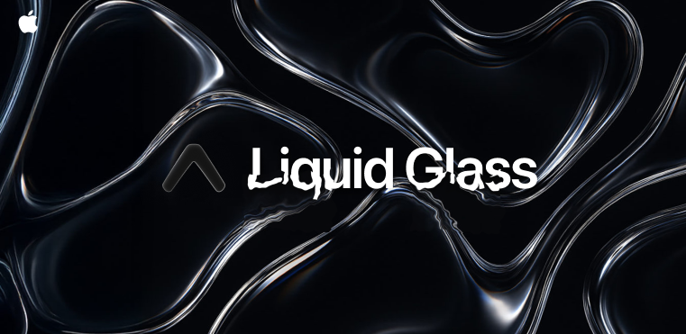

<p align="center">
  
</p>

<h1 align="center">expo-liquid-glass-view</h1>

<p align="center">
  Liquid Glass for React Native — Apple's native material on iOS 26, a custom Metal renderer below
  it, and an AGSL port of that renderer on Android 13+.
</p>

## Install

```bash
npx expo install expo-liquid-glass-view
npx expo prebuild
npx expo run:ios      # or: npx expo run:android
```

No config plugin and no manual Gradle or Podfile edits — autolinking handles both platforms.

iOS 16.4+ and Android 10+ (API 29). On web, and on Android below API 29, the components render as
plain views. **Android additionally needs a `LiquidGlassProvider`** — see [Android](#android).

## Usage

```tsx
import { LiquidGlassView } from "expo-liquid-glass-view";

<LiquidGlassView
  variant="regular"
  cornerRadius={32}
  tint="#4da3ff33"
  interactive
  style={{ width: 260, height: 120 }}
  containerStyle={{ alignItems: "center", justifyContent: "center" }}
>
  <Text style={{ color: "#fff" }}>Liquid Glass</Text>
</LiquidGlassView>;
```

Corners take one number for all four, or an object for per-corner control.

```tsx
<LiquidGlassView cornerRadius={32} />
<LiquidGlassView cornerRadius={{ topLeft: 32, topRight: 32 }} />
```

### Backends

`renderer` defaults to `"auto"` — `UIGlassEffect` on iOS 26+, the Metal renderer below it. Force one with `renderer="native"` or `renderer="metal"`, and read back what a device actually chose:

```tsx
import { supportsNativeGlass } from "expo-liquid-glass-view";

<LiquidGlassView onRendererChange={(renderer) => console.log(renderer)} />;
```

`supportsNativeGlass` is a boolean, resolved once at import.

On Android `renderer` has no effect — there is no Apple material to ask for, so both `"native"` and
`"metal"` resolve to the shader path exactly as `"native"` does on iOS below 26. An existing iOS
screen needs no branching on it.

## Android

<p align="center">
  
  
</p>

<p align="center">
  <sub>The example app's <b>playground</b> tab — every <code>metal</code> dial on a slider, a draggable
  glass panel, and a JSON readout of the current configuration ready to paste into your
  <code>&lt;LiquidGlassView /&gt;</code>. Shot on a Galaxy S23 on the <code>agsl</code> tier.</sub>
</p>

Android has **no equivalent of `UIGlassEffect`**. No Android primitive lets an in-app view sample the
pixels of its siblings: `View.setRenderEffect` applies to a view's *own* content, and
`Window.setBackgroundBlurRadius` is cross-*window* only and disabled on many OEM builds. So Android
gets a port of the **Metal renderer** — the path iOS uses as a *fallback* — and never Apple's
material.

That has one consequence you have to design around: the backdrop must be captured explicitly, so you
mark it with a `LiquidGlassProvider`.

```tsx
import { LiquidGlassProvider, LiquidGlassView } from "expo-liquid-glass-view";

<View style={{ flex: 1 }}>
  <LiquidGlassProvider style={StyleSheet.absoluteFill}>
    <ScrollView>{/* everything that should show THROUGH the glass */}</ScrollView>
  </LiquidGlassProvider>

  <LiquidGlassView style={styles.panel} cornerRadius={32} />
</View>;
```

**Glass views must be siblings of the provider, drawn after it — never children of it.** That is
what keeps a glass view out of its own backdrop, and it is structural rather than filtered. A glass
view nested inside a provider refracts its own output; dev builds warn when you do it.

The provider renders as a plain `View` on iOS, web, and pre-API-29 Android, so you can wrap
unconditionally and ship one component tree.

Pair a view with a provider by `providerId` when you have more than one; both default to `"default"`.
Ids are namespaced **per window**, which matters for `Modal` below.

### API levels and degradation

| API | `onRendererChange` reports | What you get |
| --- | --- | --- |
| 33+ | `"agsl"` | The full shader: refraction, chromatic dispersion, angular highlight, frost, tint, film grain |
| 31–32 | `"fallback-blur"` | Blur, saturation, frost and tint, clipped to the outline. No refraction |
| 29–30 | `"scrim"` | The live backdrop drawn straight through under a translucent scrim. No blur |
| < 29 | — | A plain `View`; the native view is never mounted |

Degradation is automatic. It also drops a tier if the shader fails to compile *or* silently renders
nothing — a real failure mode on some drivers, caught by an off-screen render probe at startup rather
than left for a user to discover.

### `metal.android`

Android-only; iOS drops the key.

| Field | Type | Description |
| --- | --- | --- |
| `quality` | `"low" \| "medium" \| "high"` | How much of the shader to run. `medium` (8 dispersion taps) is the iOS-parity default; `high` is 16; `low` drops dispersion and grain for roughly a fifth of the cost. Leave it unset to let coverage decide |
| `maxTier` | `"agsl" \| "fallback-blur" \| "scrim" \| "none"` | A **ceiling** on the table above. It can only lower a device, never raise one. Useful for capping very large glass surfaces, and for exercising the fallbacks on hardware that would never take them |

### Performance

Glass is fill-rate bound, and the honest guidance is **don't cover the screen in it**. Measured on an
Adreno 740 at 120 Hz with one animating glass view, janky frames by screen coverage:

| coverage | 5 % | 10 % | 25 % | 50 % | 75 % | 100 % |
| --- | --- | --- | --- | --- | --- | --- |
| jank | 0.6 % | 2 % | 2 % | 18 % | 78 % | 80 % |

Above **25 % coverage** an unset `quality` drops to `low` automatically. Be aware that this is worth
about 1 ms — no quality setting makes a full-screen glass panel hold 120 Hz.

How that budget feels across GPU generations — janky frames on a release build by scenario
(`dumpsys gfxinfo` deadline accounting; p50 frame latency in parentheses where it tells the real
story):

| scenario | Adreno 512 · 2019 budget | Adreno 610 · current budget | Adreno 740 · flagship |
| --- | --- | --- | --- |
| pinned glass bars over a scrolling feed | 1.7 % | 0.8 % | 2.5 % at 120 Hz |
| `interactive` press, drag and release | 7.5 % | 2.6 % (13 ms) | — |
| one small glass view animating continuously | 33 % at 45 fps (61 ms) | 65 % at 60 fps (20 ms) | 0.14 % (5 ms) |
| flinging a list of 24 glass rows | 88 % (89 ms) | 44 % (26 ms) | 0.75 % at 102 fps |

Devices: Redmi Note 7 (Snapdragon 660, API 34), Redmi Note 13 4G (Snapdragon 685, API 35), Galaxy
S23 Ultra (Snapdragon 8 Gen 2, API 36) — all on the `agsl` tier, all rendering correctly with zero
warnings.

The two patterns real UIs actually ship — pinned bars and press feedback — are fine on
**everything**, including a six-year-old budget phone. The two that are not — continuous animation
and scrolling many glass rows at once — degrade with GPU generation and nothing else: 88 → 44 →
0.75 % down the list row is a pure fill-rate ladder. On budget targets, give those screens
`metal.android.maxTier: "fallback-blur"` (HWUI's blur is far cheaper than the shader); no `quality`
setting rescues them.

### Things that do not work, and why

- **Video behind glass needs `TextureView`.** `SurfaceView` composites out of process and punches a
  transparent hole through the app's window, so no `Canvas` or `RenderNode` path can capture it — it
  is a hole in the backdrop. `expo-video` accepts `surfaceType="textureView"`. Dev builds warn if a
  `SurfaceView` turns up inside a provider.
- **Turn off stretch overscroll on any scroller containing glass** (`overScrollMode="never"`).
  Android 12+ draws overscroll as a pixel-space `RenderEffect` on the scroller's own `RenderNode`, so
  the glass and the backdrop baked into it are warped together while the provider behind stays flat.
  Nothing inside the container can compensate: the stretch is invisible to `getLocationInWindow`,
  `View.getMatrix()`, and every public API — `EdgeEffect.getDistance()` exists but `ScrollView` and
  `RecyclerView` keep their `EdgeEffect` instances private.
- **A `Modal` is its own window.** It needs its own provider; one in the activity will be refused
  rather than silently drawn in the wrong coordinate space. A modal also cannot refract the activity
  behind it — a provider records a view tree, and the activity is not in the modal's tree.
- **Glass does not refract other glass by default.** A glass view is never inside its own
  provider's recording, so sibling panels do not see each other — the same property that gives
  Android free self-exclusion. Stacking is opt-in via `LiquidGlassStack`: see
  [Stacked glass](#stacked-glass).

### Stacked glass

Glass *can* refract glass below it — a slider under a bottom sheet, a tab bar over glass rows.
`LiquidGlassStack` is the way to ask for it: layers go bottom to top, and glass in a layer
automatically refracts everything below, **including lower layers' finished glass** — frost, rim
and refraction, bent again by the upper lens, live while the lower glass animates or drags:

```tsx
<LiquidGlassStack style={{ flex: 1 }}>
  <LiquidGlassStack.Layer>
    <ScrollView>{content}</ScrollView>
  </LiquidGlassStack.Layer>
  <LiquidGlassStack.Layer>
    <GlassSlider />                {/* any component with a LiquidGlassView inside —   */}
  </LiquidGlassStack.Layer>       {/* no providerId props anywhere                     */}
  <LiquidGlassStack.Layer>
    {sheetOpen && <GlassSheet />}  {/* toggle content INSIDE a layer, never the layer   */}
  </LiquidGlassStack.Layer>
</LiquidGlassStack>
```

Each layer boundary is a nested `LiquidGlassProvider` with an auto-generated id, delivered to
descendant glass views through context — which is what lets a reusable glass component drop into
any layer without a `providerId` prop. An explicit `providerId` still wins where set, and
`useGlassStackProviderId()` reads the injected id for the rare component that must forward it
somewhere context cannot follow. The `stack` tab in the example app is a stack with a
stacked/flat toggle; dev builds log a one-time **info** line (not a warning) for the topology.

Two rules:

- **Keep the layer list static.** Adding or removing a `Layer` changes the provider nesting and
  remounts every layer below it; toggling content inside a static layer is free, and an empty
  layer slot costs nothing — a consumer-less provider skips recording entirely.
- **Budget for the overlap.** Where the layers overlap, the lower view's shader runs a second time
  inside the upper view's backdrop (clipped to the overlap). Bars and sheets over widgets are
  fine; stacking two huge surfaces is not. Every extra layer is another recording pass over
  everything below it — two or three layers is the sane budget.

The stack is only convenience — the same topology can be wired by hand by nesting a provider
around (the lower provider + its glass) and pointing the upper glass at the outer one. If you do,
give every provider **exactly one normal-flow child** and position everything inside it;
absolutely-positioned children at index ≥ 1 directly under a provider currently get broken
frames.

Set `setGlassDebugLogging(true)` to log provider-recording and glass-draw rates under the
`ExpoLiquidGlass` tag. Both counters stop moving when the screen is at rest.

## Props

| Prop | Type | Default | Platforms | Description |
| --- | --- | --- | --- | --- |
| `variant` | `"regular" \| "clear"` | `"regular"` | iOS · Android | Material character. `clear` is thinner and less frosted. |
| `renderer` | `"auto" \| "native" \| "metal"` | `"auto"` | iOS | Which backend draws the glass. Accepted and ignored on Android — there is no native material to ask for. |
| `cornerRadius` | `number \| { topLeft?, topRight?, bottomRight?, bottomLeft? }` | `0` | iOS · Android | One radius for every corner, or one per corner. |
| `cornerStyle` | `"continuous" \| "circular"` | `"continuous"` | iOS 26+ | Corner curvature. Ignored by the Metal renderer and on Android, both of which are circular-only. |
| `tint` | `ColorValue` | — | iOS · Android | Colour washed through the glass; alpha controls strength. |
| `interactive` | `boolean` | `false` | iOS 26+ · Android | System touch response. On Android: the specular blooms under the finger, the refraction dents and deepens around it, and the view inflates, follows the drag and stretches along it, rubber-band style — native springs, no JS per frame; lower tiers keep the feedback as an additive wash. A press held ~150 ms owns the gesture, so dragging glass doesn't scroll it away. Ignored by the Metal renderer. |
| `providerId` | `string` | `"default"` | Android | Which `LiquidGlassProvider` supplies the backdrop. iOS captures the whole window and ignores it. |
| `metal` | `GlassMetalOptions` | — | iOS · Android | Custom-renderer tuning. Ignored whenever `renderer` resolves to `"native"`. |
| `style` | `StyleProp<ViewStyle>` | — | iOS · Android | Style for the native glass view. |
| `containerStyle` | `StyleProp<ViewStyle>` | — | iOS · Android | Style for the wrapper around `children`. |
| `children` | `React.ReactNode` | — | iOS · Android | Content rendered inside the glass. |
| `onRendererChange` | `(renderer) => void` | — | iOS · Android | Fires with `"native"`, `"metal"`, `"agsl"`, `"fallback-blur"`, `"scrim"` or `"none"`. |

### `metal`

Shapes the custom renderer only — Apple owns the equivalents internally, so it is ignored whenever `renderer` resolves to `"native"`. Leave a field unset to follow `variant`.

```tsx
<LiquidGlassView
  renderer="metal"
  metal={{
    blurRadius: 4,
    frost: 0.4,
    saturation: 1.8,
    refraction: { amount: 80, width: 24, height: 24, depth: 1 },
    dispersion: { amount: 8 },
    highlight: { intensity: 0.3, angle: 135 },
    border: { width: 1, opacity: 0.3 },
  }}
/>
```

| Field | Type | Platforms | Description |
| --- | --- | --- | --- |
| `blurRadius` | `number` | iOS · Android | Backdrop blur radius, in points. |
| `captureQuality` | `number` | iOS | Backdrop capture resolution, as a multiplier on screen scale. Floor `0.25`, default `1`. Accepted and ignored on Android, which records a display list rather than pixels, so there is nothing to scale. |
| `opacity` | `number` | iOS · Android | Opacity of the glass layer, `0`–`1`. Default `1`. |
| `frost` | `number` | iOS · Android | How far the backdrop is pulled toward the interface background colour. The main dial for reading as a material rather than a plain blur. |
| `saturation` | `number` | iOS · Android | Backdrop saturation multiplier. System materials sit well above `1`. Deliberately unclamped — a negative value reflects each channel through the luma and inverts hue rather than draining it. |
| `noise` | `number` | iOS · Android | Film grain, hiding banding in the blurred backdrop. Dropped by `quality: "low"`. |
| `light` | `number` | iOS · Android | Flat brightness added before the rim sheen. Small values, `0`–`0.1`. |
| `refraction.amount` | `number` | iOS · Android | How far the rim drags the backdrop, in points — the biggest dial on how strong the glass reads. |
| `refraction.width` / `.height` | `number` | iOS · Android | How far in from the left/right and top/bottom edges the stretch reaches. On iOS, **`height` also sets how far the angular highlight fades in from the edge** — there the highlight has no width of its own. Android's highlight does: `highlight.width`. |
| `refraction.depth` | `number` | iOS · Android | Direction blend, edge normal (`0`) to radial (`1`). Radial makes corners sweep. |
| `refraction.swirl` | `number` | Android | How far the edge refraction leans toward `highlight.angle`'s light axis, unitless like `depth`. Default `0` — pixel measurement of real iOS 26 found no lean; the twist the eye reads is `depth`'s radial term sweeping the corners. A stylisation knob: positive leans toward the light, negative away, clamped to `[-1, 1]`. iOS drops the key. |
| `refraction.curve` | `{ power?, bias? }` | iOS · Android | Falloff shaping across the band. Reach for it last. All-or-nothing: supplying `power` alone takes `bias: 0` rather than the variant's. |
| `dispersion.amount` | `number` | iOS · Android | Chromatic split along the edge, in points. Dropped by `quality: "low"`. |
| `dispersion.reach` | `number` | iOS · Android | How far in from the edge the split reaches. Falls back to the *refraction height default*, not to your `refraction.height`. |
| `highlight.intensity` | `number` | iOS · Android | Specular rim strength, `0`–`1`. Set `0` to remove the glass border light entirely (on iOS, the shine and shading). |
| `highlight.angle` | `number` | iOS · Android | Light direction in degrees. Default `180` — a vertical light axis: top and bottom edges lit, side rims dying at the midpoints, which is what real iOS 26 bars measure. On iOS the opposite edge darkens by the same amount and `angle + 180` inverts the bevel. On Android the rim lights **both** lobes on that axis, so the highlight is fully 180°-periodic, and the same angle also steers the border gradient, the dark flank contour and the `refraction.swirl` lean. |
| `highlight.width` | `number` | Android | Depth of the crisp border-light line, in dp. Default `0.75` — Apple's line measures 2–3 px on a 238 px icon. A separate faint ~7 dp sheen under the lit edges rides the same lobes; there is deliberately no drawn dark line — the dark edge seen on real icons is the refraction fold imaging dark content, which the lens produces by itself. All of it replaces the Metal fallback's `refraction.height`-wide wash, which multiplied (so it vanished over dark backdrops), lit one lobe only, and faked an inset shadow real glass does not have. iOS drops the key. |
| `highlight.falloff` | `number` | Android | Angular falloff exponent of the rim's two lobes. Default `1`; higher concentrates the light at the lobes. iOS drops the key. |
| `border.width` | `number` | iOS · Android | Edge stroke width. `0` disables. Default `1`. |
| `border.opacity` | `number` | iOS · Android | Edge stroke opacity. On iOS the stroke is a black→white→white→black diagonal gradient; on Android it is **pure white light** fading out at the ends of the `highlight.angle` axis — real iOS 26 glass has no dark edge component, so the port deliberately drops the black. |
| `android` | `{ quality?, maxTier? }` | Android | See [`metal.android`](#metalandroid). iOS drops the key. |

### `LiquidGlassContainer`

Wraps sibling glass views so they merge into one another as they get close, the way system controls do. iOS 26+; elsewhere a plain `View`.

```tsx
import { LiquidGlassContainer, LiquidGlassView } from "expo-liquid-glass-view";

<LiquidGlassContainer spacing={40} style={{ flexDirection: "row", gap: 12 }}>
  <LiquidGlassView cornerRadius={24} style={{ width: 64, height: 64 }} />
  <LiquidGlassView cornerRadius={24} style={{ width: 64, height: 64 }} />
</LiquidGlassContainer>;
```

| Prop | Type | Default | Description |
| --- | --- | --- | --- |
| `spacing` | `number` | system | Distance, in points, at which nested glass elements begin to merge. |

## How the Metal path works

Below iOS 26 there is no system Liquid Glass, so the effect is rebuilt in three steps.

**Capture.** The window is rasterised into an `MTLTexture` at reduced scale, clipped to the union of the on-screen glass views and padded for blur reach. `CGContext` draws straight into the texture's `MTLBuffer`, so there is no upload step, and two buffers alternate so the CPU never writes memory the GPU is still reading. A Metal-backed view's own content is excluded, otherwise it refracts its own output and smears; views on the native path stay in, so a Metal glass moving over a native one still refracts it. SwiftUI content is composited by the render server and comes out of `CALayer.render(in:)` blank, so hosting views — `@expo/ui`'s `<Host>` included — are drawn in a second `drawHierarchy(in:)` pass that lands on top of the window pass.

**Blur.** Separable gaussian, horizontal then vertical, in capture space. Each view reads its own sub-rect of the shared texture through a UV offset, so N views cost the same as one.

**Glass.** One pass into the drawable: refraction, chromatic dispersion along the edge tangent, saturation, frost, tint, grain, an angular rim glow, and an antialiased shape mask. Refraction scales the sample coordinate about the centre by an exponential falloff of distance-to-edge, so a rim pixel reads content from further in and the whole surface refracts like a lens rather than leaving a flat interior. It is a pure coordinate remap, so it needs no render target of its own.

Every glass view encodes into a single command buffer per frame, driven by one shared display link, and presents asynchronously — nothing waits on the GPU from the main thread. The remaining per-frame cost is `CALayer.render(in:)` over the window, inherent to sampling outside the compositor. Its measured cost feeds a rate limiter that holds capture to a fixed share of the frame budget, so a dense screen settles to a lower refresh rate instead of dropping frames. On iOS 26 none of this applies — `UIGlassEffect` samples in the compositor directly.

## How the Android path works

Same three steps, different primitives, and one structural difference that removes a whole class of
bugs.

**Capture.** `LiquidGlassProvider` records its subtree into a `RenderNode` — a *display list*, not a
rasterisation, so re-recording costs nothing like a screenshot. A recorded display list holds live
references to its child nodes, so content that has not changed is re-rasterised by the GPU for free.
Each glass view then draws that node into its own padded node, transformed by a provider-to-local
matrix, and applies the effect chain there — never on the provider's node, and never via
`View.setRenderEffect`, which cannot be cropped and clips to the view bounds.

Because a glass view is a **sibling** of the provider rather than a descendant, self-exclusion is
structural. iOS has to filter its own views out of the capture; Android cannot include them in the
first place.

**Blur and glass.** `RenderEffect.createChainEffect` runs `createBlurEffect` and then the AGSL shader
in one pass: refraction (leaning toward the highlight's light axis — the iOS 26 "swirl"), chromatic
dispersion along the edge tangent, saturation, frost, tint, grain, the glass border light and an
antialiased rounded-rect SDF mask. HWUI propagates the device clip into the
filter's requested output rect, so clipping to the view before drawing genuinely shrinks the shaded
region — a 90× padded node costs +2 ms, not 90×.

**Scheduling.** Nothing is on a timer. The provider re-records only when its content actually
changes, and glass views redraw only when the provider's content generation moves *or* when their own
position in the window changes — the latter watched by an `OnPreDrawListener`, because a `FlatList`
scrolling glass rows re-records the *list's* display list, not each row's, so a row's own
`dispatchDraw` never runs while it moves. At rest both counters read zero.

## Support

| Platform | Backend | `onRendererChange` |
| --- | --- | --- |
| iOS 26+ | `UIGlassEffect` | `"native"` |
| iOS 16.4–25 | Metal renderer | `"metal"` / `"fallback-blur"` |
| Android 13+ (API 33) | AGSL renderer — a port of the Metal one | `"agsl"` |
| Android 12–12L (API 31–32) | `RenderEffect` blur, no refraction | `"fallback-blur"` |
| Android 10–11 (API 29–30) | Live backdrop under a scrim | `"scrim"` |
| Android < 10, web | Not supported — plain `View` | — |

Verified on a Galaxy S23 (Adreno 740, API 36) and a Galaxy Note 4 (Mali-T760, API 32). The API 29–30
tier has not been run on period hardware.

## Preview

https://github.com/user-attachments/assets/a08878fb-6a90-474b-8f21-1b46fe990177

## License

MIT © [rit3zh](https://github.com/rit3zh)

Parts of the Android AGSL shader — the rounded-rect signed-distance decomposition, the
`size`/`offset` device-pixel framing, and the padding budget carried through the effect chain — are
derived from [AndroidLiquidGlass](https://github.com/Kyant0/AndroidLiquidGlass), Apache-2.0,
© 2025 Kyant. See [NOTICE](./NOTICE) for the precise scope.
